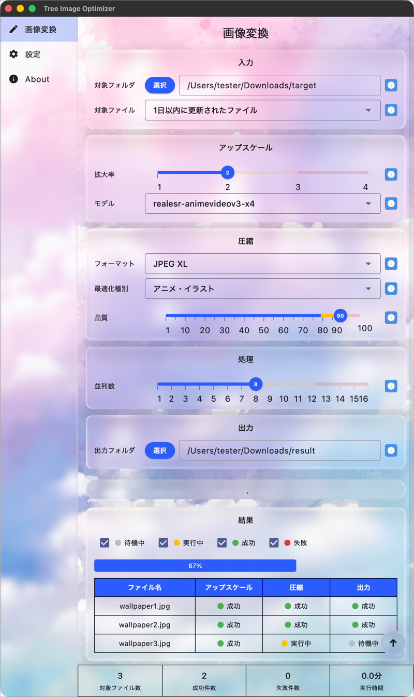
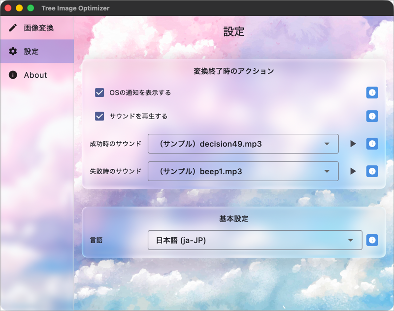
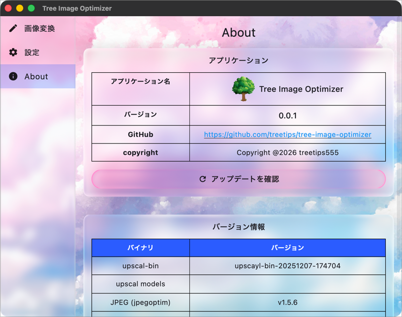

## Gitリポジトリ・ダウンロード

- [リポジトリ](https://github.com/treetips/tree-image-optimizer)
- [ダウンロードはこちらから](https://github.com/treetips/tree-image-optimizer/releases/latest)

現状 `macOSのみの対応` となっています。

## 画面キャプチャ

無駄に [Liquid Glass風](https://ja.wikipedia.org/wiki/Liquid_Glass) です。

## 何をするツールですか？

フォルダに沢山画像ファイルが存在して、それらに対して以下を `並列` に実行します。

### アップスケール

`アップスケール` は `超解像技術` を使い、2倍〜4倍の画像サイズに拡大することができます。緒解像技術を使った拡大なので、ボヤけ等は少ないです。

### 圧縮

4倍にアップスケールすると画像サイズも4倍近くになりますが、圧縮することでファイルサイズを小さくすることができます。

[JPEG XL](https://jpegxl.info/index.html) か [AV1](https://aomedia.org/specifications/av1/) といった `次世代の画像フォーマット` で圧縮すると、ほぼ劣化させずに画像サイズを圧縮可能です。

macOSであれば、壁紙に `JPEG XL` ・ `AV1` 共に対応しています。

## 進捗状況をリアルタイムに表示

例えば `画像A` が、アップスケールは完了したか？圧縮は完了したか？ファイル出力は完了したか？を、 `ファイル毎にリアルタイム表示` します。

### 変換後のアクション

変換完了時にアプリケーション内で通知するようにしています。

それに加え、 `OSの通知` と `音を鳴らす` ことも、設定画面で設定可能です。

#### OSの通知

OSの権限設定が別途必要です。OSのことは本アプリケーションの管轄外なので、自力で設定してください。

#### 音を鳴らす

`成功時のサウンド` と `失敗時のサウンド` を別途設定でき、両者とも2ファイルずつデフォルトサウンドを同梱しています。

それに加え、 [所定のパスにファイルを配置すると自分で用意した音を鳴らすことができる](https://github.com/treetips/tree-image-optimizer#%E3%83%A6%E3%83%BC%E3%82%B6%E3%83%BC%E3%81%8C%E7%94%A8%E6%84%8F%E3%81%97%E3%81%9F%E3%82%B5%E3%82%A6%E3%83%B3%E3%83%89%E3%83%95%E3%82%A1%E3%82%A4%E3%83%AB%E3%82%92%E9%85%8D%E7%BD%AE%E3%81%99%E3%82%8B) ことができるようにしました。

私は `Text to Speach(TTS)` と `Whisper` で、人間の声を使って自由に喋らせる仕組みで成功時・失敗時のサウンドを生成して設定しています。

## 設定の復元

アプリケーションを起動する度に再設定が必要だと面倒なので、 [アプリケーション設定ファイル](https://github.com/treetips/tree-image-optimizer#%E3%82%A2%E3%83%97%E3%83%AA%E3%82%B1%E3%83%BC%E3%82%B7%E3%83%A7%E3%83%B3%E8%A8%AD%E5%AE%9A%E3%83%95%E3%82%A1%E3%82%A4%E3%83%AB) をアプリ起動時に作成し、設定をそのファイルに追記し、アプリ起動時に設定ファイルを読み込むことで、アプリケーションの設定を永続化するようにしました。

## 並列に高速に処理をします

`CPUのコア数` を取得し、並列数の最大値をコア数分に設定することができます。例えば並列数を `4` にすると、 `4ファイル同時処理` します。 `アップスケール・圧縮` のステップは `シーケンシャル` に処理を行います。並列なのは `ファイル単位の処理` です。

並列数をコア数に設定するとCPUを完全に使い果たしてしまい、OSの反応が無くなるほどの負荷がかかるので、初期設定値はコア数の半分程度を指定するようにしました。

その対策として、各種設定で「これは負荷が高いから気をつけてね」という段階を、スライダー上で `黄色（重いよ）` `赤色（負荷凄いから覚悟して）` と視覚的に分かるようにしました。

## なんで作ったの？

元々シェルスクリプトでこのツールを作成済みだったのですが、GitHubで公開していませんでした。

公開すると、設定の変更のし易さ等を問われてしまうので、それが原因で萎縮するのが嫌だったので、個人ツールにとどめていました。

しかし、AIのエージェントが発達したことを機に、デスクトップアプリケーション化してみた、という流れです。

## 開発秘話的なもの

### バイブコーディングで実装しました

所謂「全く自分でコードを書かずにアプリケーションを完成させる」手法です。

シェルスクリプトバージョンは `エージェントを使わずフルスクラッチで実装` していました。

今回 `Flutter` でクロスプラットフォームアプリとして実装したのですが、私は `Flutter未経験` です。エージェントで実装したコードもほぼ読んでいません。

ただ、TypeScript + Reactを使ったフロントエンドの心得が有るので、実装未経験でも雰囲気で大体読めます。

### どんなツール・仕組み使った？

[OpenCode](https://opencode.ai/) のデスクトップアプリケーションを使いました。

最初は [Hermes Agent](https://hermes-agent.org/ja/) を使っていたのですが、OpenCodeの方は `期間限定の無料モデルが多数有る` ので、OpenCodeで無料モデルでゴリゴリ実装していました。

IDEは `Android Studio` です。VSCodeでもいいのですが、 `Android Studio` の方が最初から環境が揃っているので楽です。

## 今後の展望は？

今の所 `macOS` のみの対応ですが、Flutterなので `Windows` にも対応は可能です。やる気があったら対応する可能性はあります。

圧縮フォーマットに関しては、 `AV2` 等の次世代フォーマットが登場したら対応する可能性はあります。
